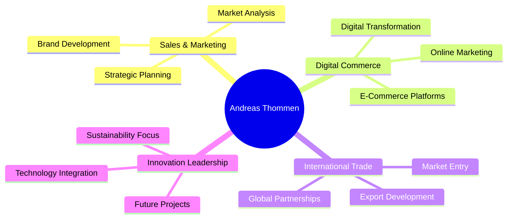

# 🇩🇪 MADE IN GERMANY GLOBAL

---

## 🚀 **VISION**

> **Positioning German companies and manufacturers on the international stage with clear visibility for buyers and distributors worldwide.**

---

<!-- Language Toggle Buttons -->

---

<!-- English Content -->

## 👑 **FOUNDER & CEO**

### 🌟 **LEADERSHIP PROFILE**

**👤 Full Name:** Andreas Thommen  
**🎂 Born:** 1972  
**🏛️ Base:** Hanseatic City of Bremen, Germany 🇩🇪  
**🎯 Role:** Founder & Chief Executive Officer  

---

### 🎯 **CORE EXPERTISE**

**🌍 International Trade Development**  
*Specialist in connecting German manufacturers with global markets, facilitating cross-border business relationships and export growth strategies.*

**📊 Sales & Marketing Mastery**  
*Decades of experience in developing comprehensive sales strategies and marketing campaigns that drive measurable business growth.*

**💻 Digital Commerce Pioneer**  
*Leading the digital transformation of traditional German industries through innovative online platforms and e-commerce solutions.*

**🚀 Export Industry Champion**  
*Dedicated to strengthening Germany's position in global markets by making German products more accessible to international buyers.*

---

### 💭 **LEADERSHIP PHILOSOPHY**

> *"From this background, the vision emerged to digitally relaunch and strengthen the label Made in Germany. My ambition is to position German companies and manufacturers more strongly on an international scale – with clear visibility for buyers and distributors worldwide."*

**— Andreas Thommen, Founder & CEO**

---

### 🎖️ **MISSION & IMPACT**

**🎯 Primary Mission**  
*Strengthening German export industry through digital innovation and global market accessibility*

**💡 Strategic Vision**  
*Complete digital relaunch of the legendary "Made in Germany" label for the modern global marketplace*

**🚀 Ultimate Goal**  
*Creating seamless connections between international buyers and authentic German manufacturers*

**⭐ Professional Foundation**  
*Built on years of hands-on experience in sales, marketing, and the evolving digital commerce landscape*

---

## 🌍 **GLOBAL INFRASTRUCTURE**

### 🔗 **Development Platforms**
- **Personal GitHub:** [`github.com/made-in-germany-global`](https://github.com/made-in-germany-global)
- **Organization:** [`github.com/made-in-germany-international`](https://github.com/made-in-germany-international)

### 🌐 **Digital Foundation**

**Core Domains:**
- `made-in-germany.global` • `made-in-germany.foundation` • `made-in-germany.uk`
- `madeingermany.global` • `madeingermany.foundation` • `madeingermany.ag`

---

## 🗺️ **REGIONAL PRESENCE**

**🌏 Asian Markets:** China, Vietnam, India  
**🌍 African Markets:** Continental Africa focus  
**🌎 Latin American Markets:** Regional expansion  
**🕌 Arab Markets:** Arabia, Middle East  
**🏔️ Eastern Markets:** Russia, Turkey, Eastern Europe

---

## 📊 **PORTFOLIO SCALE**

---

## 📧 **CONNECT**

---

<!-- German Content (Hidden by default, shown when German button is clicked) -->

## 👑 **GRÜNDER & CEO**

### 🌟 **FÜHRUNGSPROFIL**

**👤 Vollständiger Name:** Andreas Thommen  
**🎂 Geboren:** 1972  
**🏛️ Standort:** Hansestadt Bremen, Deutschland 🇩🇪  
**🎯 Position:** Gründer & Geschäftsführer  

---

### 🎯 **KERNKOMPETENZ**

**🌍 Internationale Handelsentwicklung**  
*Spezialist für die Verbindung deutscher Hersteller mit globalen Märkten und die Förderung grenzüberschreitender Geschäftsbeziehungen.*

**📊 Verkaufs- und Marketing-Expertise**  
*Jahrzehntelange Erfahrung in der Entwicklung umfassender Verkaufsstrategien und Marketingkampagnen mit messbarem Geschäftswachstum.*

**💻 Digital Commerce Pionier**  
*Führend bei der digitalen Transformation traditioneller deutscher Industrien durch innovative Online-Plattformen.*

**🚀 Export-Industrie-Champion**  
*Engagiert für die Stärkung Deutschlands Position auf den Weltmärkten durch bessere Zugänglichkeit deutscher Produkte.*

---

### 💭 **FÜHRUNGSPHILOSOPHIE**

> *"Aus diesem Hintergrund entstand die Vision, das Label Made in Germany digital zu relaunchen und zu stärken. Mein Anspruch ist es, deutsche Unternehmen und Hersteller international stärker zu positionieren – mit klarer Sichtbarkeit für Einkäufer und Distributoren weltweit."*

**— Andreas Thommen, Gründer & CEO**

---

### 🎖️ **MISSION & EINFLUSS**

**🎯 Hauptmission**  
*Stärkung der deutschen Exportindustrie durch digitale Innovation und globale Marktzugänglichkeit*

**💡 Strategische Vision**  
*Kompletter digitaler Relaunch des legendären "Made in Germany" Labels für den modernen globalen Markt*

**🚀 Oberstes Ziel**  
*Nahtlose Verbindungen zwischen internationalen Käufern und authentischen deutschen Herstellern schaffen*

---

## 🌍 **GLOBALE INFRASTRUKTUR**

### 🔗 **Entwicklungsplattformen**
- **Persönliches GitHub:** [`github.com/made-in-germany-global`](https://github.com/made-in-germany-global)
- **Organisation:** [`github.com/made-in-germany-international`](https://github.com/made-in-germany-international)

### 🌐 **Digitale Grundlage**

**Kern-Domains:**
- `made-in-germany.global` • `made-in-germany.foundation` • `made-in-germany.uk`
- `madeingermany.global` • `madeingermany.foundation` • `madeingermany.ag`

---

## 📊 **PORTFOLIO-UMFANG**

---

## 📧 **KONTAKT**

---

**Made with 💙 in Bremen, Germany**

*Connecting German Excellence with Global Markets*

<!-- Instructions for Language Toggle -->
<!-- 
GITHUB README LANGUAGE TOGGLE INSTRUCTIONS:

Since GitHub doesn't support JavaScript in README files, the language toggle works through anchor links and manual section management. 

To implement a working language toggle:

1. Use the current structure with anchor links (#english-content, #german-content)
2. For a more advanced solution, consider:
   - Creating separate README files (README.md, README-de.md)
   - Using GitHub Actions to automatically generate language versions
   - Implementing a simple redirect system

The current version provides a foundation that users can click to navigate between sections, though it won't hide/show content automatically due to GitHub's limitations.
-->
