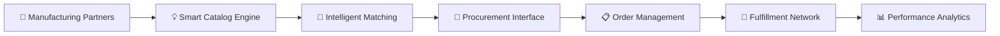

# Made in Germany GLOBAL | Digital B2B Excellence Platform 2025+

<div align="center">

```ascii
██████╗ ██████╗ ██████╗     ███████╗██╗  ██╗ ██████╗███████╗██╗     ██╗     ███████╗███╗   ██╗ ██████╗███████╗
██╔══██╗╚════██╗██╔══██╗    ██╔════╝╚██╗██╔╝██╔════╝██╔════╝██║     ██║     ██╔════╝████╗  ██║██╔════╝██╔════╝
██████╔╝ █████╔╝██████╔╝    █████╗   ╚███╔╝ ██║     █████╗  ██║     ██║     █████╗  ██╔██╗ ██║██║     █████╗  
██╔══██╗██╔═══╝ ██╔══██╗    ██╔══╝   ██╔██╗ ██║     ██╔══╝  ██║     ██║     ██╔══╝  ██║╚██╗██║██║     ██╔══╝  
██████╔╝███████╗██████╔╝    ███████╗██╔╝ ██╗╚██████╗███████╗███████╗███████╗███████╗██║ ╚████║╚██████╗███████╗
╚═════╝ ╚══════╝╚═════╝     ╚══════╝╚═╝  ╚═╝ ╚═════╝╚══════╝╚══════╝╚══════╝╚══════╝╚═╝  ╚═══╝ ╚═════╝╚══════╝
```

[](https://made-in-germany.global)
[]()
[]()
[]()

**🚀 Bridging German Manufacturing Expertise with International Commerce**

</div>

## 🔗 Digital Channels:
[](https://linkedin.com/company/made-in-germany) [](https://twitter.com/made_in_germany) [](https://made-in-germany.global)

---

## 🎯 Mission 2025+: Redefining Industrial B2B Commerce

**Made in Germany GLOBAL** pioneers the next evolution of international trade by fusing German manufacturing heritage with cutting-edge digital infrastructure. We transform traditional supply chains into intelligent, automated commerce ecosystems.

### 💡 Leadership | Andreas Thommen
*Digital Innovation Expert & Business Platform Developer*

---

## ⚙️ Advanced Technology Infrastructure

   </br>
   </br>
  

### 🏗️ **Intelligent Commerce Ecosystem**


### 🎮 **Platform Features Overview**

| Component | Innovation | Business Value |
|-----------|------------|----------------|
| 🔌 **Data Synchronization** | API-First Architecture | Automated catalog management |
| 🛍️ **Bulk Procurement** | Container-Scale Orders | Direct factory negotiations |
| 🌐 **Distribution Network** | Multi-Hub Logistics | Optimized delivery routes |
| 🏪 **Partner Ecosystem** | Regional Franchising | Local market penetration |
| 🤖 **Smart Automation** | AI-Driven Workflows | Enhanced conversion rates |
| 📍 **Market Optimization** | Geo-Targeted Strategy | Localized search visibility |

---

## 🏗️ Core Industry Sectors | Engineering Heritage

<details>
<summary>⚙️ <strong>Industrial Manufacturing & Equipment</strong></summary>

Advanced manufacturing solutions and industrial machinery setting worldwide benchmarks for operational excellence and innovation.
</details>

<details>
<summary>💊 <strong>Healthcare Technology & Laboratory Solutions</strong></summary>

State-of-the-art medical devices and laboratory instruments advancing global healthcare standards and research capabilities.
</details>

<details>
<summary>🏨 <strong>Commercial Kitchen & Hospitality Equipment</strong></summary>

Professional-grade hospitality solutions enhancing service delivery across international food service and accommodation sectors.
</details>

<details>
<summary>🔧 <strong>Automotive Components & Systems</strong></summary>

High-performance automotive parts and technologies supporting next-generation mobility and sustainable transportation solutions.
</details>

<details>
<summary>⚗️ <strong>Chemical Engineering & Pharmaceutical Systems</strong></summary>

Precision chemical processing and pharmaceutical manufacturing solutions enabling breakthrough innovations across multiple industries.
</details>

---

## 📊 Key Performance Indicators:


### 📈 Business Metrics:


---

## 🚀 Platform Innovation | Advanced Capabilities

```yaml
🔹 Business Process Automation:
  - Streamlined procurement pipelines
  - Live inventory integration
  - Market demand forecasting
  - Secure transaction protocols

🔹 International Expansion:
  - Multi-currency operations
  - Regulatory compliance automation
  - Risk management integration
  - Cross-timezone coordination

🔹 Advanced Analytics:
  - Intelligent buyer profiling
  - Quality assurance scoring
  - Supply chain optimization
  - Revenue maximization algorithms
```

---

## 🚀 Platform Access | Transform Your Business

### Manufacturing Partners 🏭
1. **Onboard** → Integrate product portfolio through automated systems
2. **Optimize** → Leverage intelligent platform capabilities
3. **Expand** → Access international markets seamlessly

### Global Procurement Teams 🌍  
1. **Explore** → Access premium German manufacturing solutions
2. **Purchase** → Execute large-scale orders with single-click efficiency
3. **Track** → Monitor delivery through integrated logistics

### Regional Partners 🤝
1. **Connect** → Join our international partner network
2. **Implement** → Deploy localized market solutions  
3. **Scale** → Expand operations with proven frameworks

---

### 💭 Strategic Vision Quote


### 📊 Market Distribution


---

## 🌐 Platform Access

<div align="center">

🌐 **Digital Platform:** [made-in-germany.global](https://made-in-germany.global)

✉️ **Business Inquiries:** business@made-in-germany.global

🎯 **Next-Gen B2B** | **Intelligent Systems** | **Global Impact**

[](https://made-in-germany.global)

</div>

---

# 🇩🇪 Made in Germany International | Digitale B2B-Plattform 2025+

<div align="center">

**⚡ Deutsche Fertigungsexpertise mit Internationalem Handel Verbinden**

</div>

---

## 🎯 Mission 2025+: Neugestaltung des Industriellen B2B-Handels

**Made in Germany GLOBAL** ist Pionier der nächsten Evolution des internationalen Handels durch Verschmelzung deutschen Fertigungserbes mit modernster digitaler Infrastruktur. Wir transformieren traditionelle Lieferketten in intelligente, automatisierte Handelsökosysteme.

### 💡 Führung | Andreas Thommen
*Digital-Innovationsexperte & Business-Plattform-Entwickler*

---

## ⚙️ Fortschrittliche Technologie-Infrastruktur

   </br>
   </br>
  

### 🏗️ **Intelligentes Handelsökosystem**


### 🎮 **Plattform-Features Übersicht**

| Komponente | Innovation | Geschäftswert |
|------------|------------|---------------|
| 🔌 **Datensynchronisation** | API-First Architektur | Automatisierte Katalogverwaltung |
| 🛍️ **Mengenbeschaffung** | Container-Skalierte Bestellungen | Direkte Fabrikverhandlungen |
| 🌐 **Vertriebsnetzwerk** | Multi-Hub Logistik | Optimierte Lieferrouten |
| 🏪 **Partnerökosystem** | Regionales Franchising | Lokale Marktdurchdringung |
| 🤖 **Smart Automatisierung** | KI-gesteuerte Workflows | Verbesserte Konversionsraten |
| 📍 **Marktoptimierung** | Geo-zielgerichtete Strategie | Lokalisierte Suchsichtbarkeit |

---

## 🏗️ Kern-Industriesektoren | Ingenieurserbe

<details>
<summary>⚙️ <strong>Industrielle Fertigung & Ausrüstung</strong></summary>

Fortschrittliche Fertigungslösungen und Industriemaschinen, die weltweite Maßstäbe für operative Exzellenz und Innovation setzen.
</details>

<details>
<summary>💊 <strong>Gesundheitstechnologie & Laborlösungen</strong></summary>

Modernste medizinische Geräte und Laborinstrumente, die globale Gesundheitsstandards und Forschungskapazitäten vorantreiben.
</details>

<details>
<summary>🏨 <strong>Gewerbliche Küchen- & Hospitality-Ausrüstung</strong></summary>

Professionelle Hospitality-Lösungen, die Servicebereitstellung in internationalen Foodservice- und Beherbergungssektoren verbessern.
</details>

<details>
<summary>🔧 <strong>Automobilkomponenten & Systeme</strong></summary>

Hochleistungs-Automobilteile und Technologien, die Mobilität der nächsten Generation und nachhaltige Transportlösungen unterstützen.
</details>

<details>
<summary>⚗️ <strong>Chemieingenieurwesen & Pharmazeutische Systeme</strong></summary>

Präzisions-Chemiebearbeitung und pharmazeutische Fertigungslösungen, die bahnbrechende Innovationen in mehreren Branchen ermöglichen.
</details>

---

## 📊 Wichtige Leistungsindikatoren:


---

## 🚀 Plattform-Innovation | Erweiterte Fähigkeiten

```yaml
🔹 Geschäftsprozess-Automatisierung:
  - Optimierte Beschaffungspipelines
  - Live-Inventar-Integration
  - Marktnachfrageprognose
  - Sichere Transaktionsprotokolle

🔹 Internationale Expansion:
  - Multi-Währungs-Operationen
  - Regulatorische Compliance-Automatisierung
  - Risikomanagement-Integration
  - Zeitzonenübergreifende Koordination

🔹 Erweiterte Analytik:
  - Intelligente Käuferprofilierung
  - Qualitätssicherungs-Scoring
  - Lieferkettenoptimierung
  - Umsatzmaximierungs-Algorithmen
```

---

## 🚀 Plattformzugang | Transformieren Sie Ihr Geschäft

### Fertigungspartner 🏭
1. **Einsteigen** → Produktportfolio durch automatisierte Systeme integrieren
2. **Optimieren** → Intelligente Plattformfähigkeiten nutzen
3. **Expandieren** → Internationale Märkte nahtlos erschließen

### Globale Beschaffungsteams 🌍  
1. **Erkunden** → Zugang zu Premium-deutschen Fertigungslösungen
2. **Kaufen** → Großaufträge mit Ein-Klick-Effizienz ausführen
3. **Verfolgen** → Lieferung durch integrierte Logistik überwachen

### Regionale Partner 🤝
1. **Verbinden** → Unserem internationalen Partnernetzwerk beitreten
2. **Implementieren** → Lokalisierte Marktlösungen einsetzen  
3. **Skalieren** → Operationen mit bewährten Frameworks erweitern

---

## 🌐 Plattformzugang

<div align="center">

🌐 **Digitale Plattform:** [made-in-germany.global](https://made-in-germany.global)

✉️ **Geschäftsanfragen:** business@made-in-germany.global

🎯 **Next-Gen B2B** | **Intelligente Systeme** | **Globale Wirkung**

</div>

---

<div align="center">

**⚡ Powered by German Engineering Heritage | Angetrieben durch Deutsches Ingenieurserbe ⚡**

*Revolutionizing International B2B Trade Since 2025 | Revolution des Internationalen B2B-Handels Seit 2025*

</div>
