```mermaid
graph TB
    A[🧠 ANDREAS THOMMEN<br/>Neural Core] --> B[🌐 International Trade]
    A --> C[📊 Sales & Marketing]
    A --> D[💻 Digital Commerce]
    A --> E[🚀 Export Leadership]
    
    B --> F[🌏 Asian Markets]
    B --> G[🌍 African Expansion] 
    B --> H[🌎 Latin America]
    B --> I[🕌 Arab Markets]
    
    C --> J[📈 Strategic Planning]
    C --> K[🎯 Brand Development]
    C --> L[📊 Market Analysis]
    
    D --> M[🔮 E-Commerce Platforms]
    D --> N[⚡ Digital Transformation]
    D --> O[🤖 AI Integration]
    
    E --> P[🏭 German Manufacturing]
    E --> Q[📦 Global Distribution]
    E --> R[💎 Quality Assurance]
    
    style A fill:#000428,stroke:#00d2ff,stroke-width:3px,color:#ffffff
    style B fill:#004e92,stroke:#00d2ff,stroke-width:2px,color:#ffffff
    style C fill:#004e92,stroke:#ff0080,stroke-width:2px,color:#ffffff
    style D fill:#004e92,stroke:#9400d3,stroke-width:2px,color:#ffffff
    style E fill:#004e92,stroke:#00ffff,stroke-width:2px,color:#ffffff
```

<!-- Futuristic Header with Particle Effects -->
<div align="center">


</div>

<!-- Holographic Typing Effect -->
<div align="center">


</div>

<!-- Futuristic Badge Matrix -->
<div align="center">


</div>

<!-- Cyberpunk Divider -->
<div align="center">


</div>

<!-- Futuristic Language Matrix -->
<div align="center">


<br><br>

<table>
<tr>
<td>

<a href="#🇬🇧-english-neural-interface">

</a>

</td>
<td width="40"></td>
<td>

<a href="#🇩🇪-deutsche-neural-schnittstelle">

</a>

</td>
</tr>
</table>

</div>

<!-- Cyberpunk Divider -->
<div align="center">


</div>

<!-- ===== ENGLISH NEURAL INTERFACE ===== -->
<h1 id="🇬🇧-english-neural-interface" align="center">

ENGLISH NEURAL INTERFACE

</h1>

<!-- Advanced CEO Hologram -->
<div align="center">


</div>

<!-- Futuristic Profile Matrix -->
<div align="center">

<table>
<tr>
<td align="center" width="33%">


<br><br>

```yaml
IDENTITY:
  name: "Andreas Thommen"
  birth_year: 1972
  origin: "Bremen, Germany 🇩🇪"
  status: "Founder & CEO"
  neural_id: "MIG-GLOBAL-001"
```

</td>
<td align="center" width="33%">


<br><br>

```yaml
EXPERTISE_LEVEL:
  international_trade: 95
  digital_commerce: 92
  sales_strategy: 98
  marketing_mastery: 90
  export_leadership: 97
```

</td>
<td align="center" width="33%">


<br><br>

```yaml
GLOBAL_IMPACT:
  domains_controlled: 152
  markets_penetrated: 15+
  continents_reached: 6
  years_experience: 25+
```

</td>
</tr>
</table>

</div>

<!-- Neural Network Visualization -->
<div align="center">


</div>



<!-- Holographic Mission Statement -->
<details>
<summary>

</summary>

<div align="center">


</div>

<div align="center">

> ### 🌟 **QUANTUM LEADERSHIP MANIFESTO**
> 
> *"From the intersection of tradition and innovation, a new vision emerged: the complete digital renaissance of the legendary 'Made in Germany' brand. My quantum ambition transcends conventional boundaries—positioning German excellence on a multidimensional global stage with crystalline visibility for buyers and distributors across all realities."*
> 
> **— Andreas Thommen, Quantum CEO & Digital Pioneer**

</div>

<br>

<table align="center">
<tr>
<td align="center" width="25%">


**Digital Export Revolution**
*Quantum-level enhancement of German industry's global presence through neural commerce networks*

</td>
<td align="center" width="25%">


**Holographic Brand Evolution**
*Complete dimensional relaunch of 'Made in Germany' for the post-digital era*

</td>
<td align="center" width="25%">


**Neural Commerce Networks**
*Instantaneous global buyer-manufacturer quantum entanglement*

</td>
<td align="center" width="25%">


**Decades of Excellence**
*Multi-dimensional expertise in sales, marketing & digital evolution*

</td>
</tr>
</table>

</details>

<!-- Cyberpunk Stats Dashboard -->
<div align="center">


<br><br>

<table>
<tr>
<td align="center">


</td>
<td align="center">


</td>
</tr>
</table>

</div>

<!-- Holographic Domain Portfolio -->
<div align="center">


<br><br>


</div>

<!-- Neural Network Infrastructure -->
<details>
<summary>

</summary>

<div align="center">

<h3>🧬 QUANTUM DEVELOPMENT CORES</h3>

<table>
<tr>
<td align="center">

<a href="https://github.com/made-in-germany-global">

</a>

</td>
<td align="center">

<a href="https://github.com/made-in-germany-international">

</a>

</td>
</tr>
</table>

<h3>⚡ QUANTUM DOMAIN CLUSTERS</h3>

<table>
<tr>
<td align="center" width="25%">


`made-in-germany.foundation`
`made-in-germany.global`
`madeingermany.foundation`
`madeingermany.global`

</td>
<td align="center" width="25%">


`made-in-germany.asia`
`made-in-germany-china.com`
`made-in-germany-vietnam.com`
`madeingermanychina.com`

</td>
<td align="center" width="25%">


`made-in-germany-africa.com`
`made-in-germany.afrika`

</td>
<td align="center" width="25%">


`made-in-germany-arabia.com`
`made-in-germany-arab.com`
`madeingermanyarab.com`

</td>
</tr>
</table>

</div>

</details>

<!-- Cyberpunk Divider -->
<div align="center">


</div>

<!-- ===== DEUTSCHE NEURAL SCHNITTSTELLE ===== -->
<h1 id="🇩🇪-deutsche-neural-schnittstelle" align="center">

DEUTSCHE NEURAL-SCHNITTSTELLE

</h1>

<!-- German CEO Hologram -->
<div align="center">


</div>

<!-- Deutsche Profil Matrix -->
<div align="center">

<table>
<tr>
<td align="center" width="33%">


<br><br>

```yaml
IDENTITÄT:
  name: "Andreas Thommen"
  geburtsjahr: 1972
  herkunft: "Bremen, Deutschland 🇩🇪"
  status: "Gründer & CEO"
  neural_id: "MIG-GLOBAL-001"
```

</td>
<td align="center" width="33%">


<br><br>

```yaml
EXPERTISE_LEVEL:
  internationaler_handel: 95
  digital_commerce: 92
  verkaufsstrategie: 98
  marketing_meisterschaft: 90
  export_führung: 97
```

</td>
<td align="center" width="33%">


<br><br>

```yaml
GLOBALER_EINFLUSS:
  domains_kontrolliert: 152
  märkte_durchdrungen: 15+
  kontinente_erreicht: 6
  jahre_erfahrung: 25+
```

</td>
</tr>
</table>

</div>

<!-- Deutsche Holographische Mission -->
<details>
<summary>

</summary>

<div align="center">


</div>

<div align="center">

> ### 🌟 **QUANTUM FÜHRUNGS-MANIFEST**
> 
> *"An der Schnittstelle von Tradition und Innovation entstand eine neue Vision: die vollständige digitale Renaissance der legendären 'Made in Germany' Marke. Mein Quantum-Ehrgeiz überschreitet konventionelle Grenzen—deutsche Exzellenz auf einer multidimensionalen globalen Bühne mit kristalliner Sichtbarkeit für Käufer und Distributoren in allen Realitäten zu positionieren."*
> 
> **— Andreas Thommen, Quantum CEO & Digitaler Pionier**

</div>

<br>

<table align="center">
<tr>
<td align="center" width="25%">


**Digitale Export Revolution**
*Quantum-Level Verbesserung der globalen Präsenz deutscher Industrie durch neurale Commerce-Netzwerke*

</td>
<td align="center" width="25%">


**Holographische Marken-Evolution**
*Kompletter dimensionaler Relaunch von 'Made in Germany' für die post-digitale Ära*

</td>
<td align="center" width="25%">


**Neurale Commerce-Netzwerke**
*Instantane globale Käufer-Hersteller Quantum-Verschränkung*

</td>
<td align="center" width="25%">


**Jahrzehnte der Exzellenz**
*Multidimensionale Expertise in Vertrieb, Marketing & digitaler Evolution*

</td>
</tr>
</table>

</details>

<!-- Final Cyberpunk Contact Matrix -->
<div align="center">


<br><br>

<table>
<tr>
<td align="center">

<a href="mailto:andreas.thommen@made-in-germany.global">

</a>

</td>
</tr>
<tr>
<td align="center">

<a href="https://github.com/made-in-germany-global">

</a>

</td>
</tr>
</table>

</div>

<!-- Ultimate Footer -->
<div align="center">


<br>

**🌌 MADE WITH QUANTUM LOVE IN BREMEN, GERMANY 🌌**

*🚀 Connecting German Excellence with Infinite Realities 🚀*

<br>


</div>

<!-- Hidden quantum anchor -->
<div id="quantum-core"></div>
