# 🇩🇪 Andreas Thommen
**Founder & CEO | Made in Germany Global Initiative**

[](https://git.io/typing-svg)

<div align="center">
  

[](https://github.com/made-in-germany-global)
[](https://linkedin.com/in/andreas-thommen)

</div>

---

## 🎯 Mission Statement

> **"Positioning German companies and manufacturers more strongly on an international scale – with clear visibility for buyers and distributors worldwide."**

Born in 1972 in the historic Hanseatic City of Bremen, Germany, I bring decades of experience in **sales**, **marketing**, and the **digital economy** to revolutionize how the world discovers German excellence.

---

## 🌍 Global Vision

### **The Challenge**
International platforms lacked specialization for "Made in Germany" products, making it difficult for global buyers to specifically search for German quality and engineering excellence.

### **Our Solution** 
Creating a comprehensive digital ecosystem that:
- ✅ **Strengthens** the German export industry
- ✅ **Facilitates** international buyer connections
- ✅ **Amplifies** German product visibility worldwide
- ✅ **Bridges** the gap between German manufacturers and global markets

---

## 🏢 Digital Empire

<div align="center">

### 🏛️ **Core Foundations**
[](https://made-in-germany.global)
[](https://made-in-germany.uk)
[](https://made-in-germany.ag)
[](https://made-in-germany.foundation)

</div>

### 🌏 **Regional Market Presence**

<table align="center">
<tr>
<td align="center" width="25%">

**🏙️ Asia & India**
- made-in-germany.asia
- made-in-germany.com.in
- made-in-germany-china.com
- made-in-germany-vietnam.com
- madeingermany.in

</td>
<td align="center" width="25%">

**🦁 Africa**
- made-in-germany-africa.com
- made-in-germany.afrika

</td>
<td align="center" width="25%">

**🌎 Latin America**
- made-in-germany.lat

</td>
<td align="center" width="25%">

**🕌 Arab World**
- made-in-germany-arabia.com
- made-in-germany-arab.com
- madeingermanyarabia.com

</td>
</tr>
</table>

---

## 📊 Digital Portfolio Stats

<div align="center">


</div>

### 🎯 **Strategic Domain Architecture**

```
📁 Core Brands (4 domains)
├── 🌐 made-in-germany.global/madeingermany.global
├── 🇬🇧 made-in-germany.uk/madeingermany.uk  
├── 🏢 made-in-germany.ag/madeingermany.ag
└── 🏛️ made-in-germany.foundation/madeingermany.foundation

📁 Regional Markets (15+ domains)
├── 🌏 Asia & India Markets
├── 🦁 African Markets
├── 🌎 Latin American Markets
├── 🕌 Arab World Markets
└── 🏰 Eastern Europe & Eurasia

📁 MIG Infrastructure (8 domains)
├── 🎯 mig.global
├── 🏛️ mig.foundation
├── 📂 mig.directory
├── 💝 mig.charity
└── 🔧 mig.support

📁 Future Initiatives (125+ domains)
├── 🌱 germany-for-future.org
├── ⚡ germany-go-next.com
├── 🔮 mig-for-future.com
└── 💼 mig-b2b.com
```

---

## 💼 Professional Experience

<div align="center">


</div>

**Core Competencies:**
- 🎯 **International Sales Strategy**
- 📈 **Digital Marketing & Growth**
- 🌐 **Global Market Development**
- 🏭 **B2B Platform Architecture**
- 🤝 **Cross-Cultural Business Relations**

---

## 🚀 Current Projects

### **🏗️ Platform Development**
Building comprehensive digital infrastructure to showcase German manufacturing excellence

### **🌐 Global Network Expansion** 
Establishing strategic partnerships across 7 major global regions

### **📱 Digital Innovation**
Developing next-generation tools for international trade facilitation

### **🎓 Knowledge Hub Creation**
Creating educational resources about German quality standards and manufacturing

---

## 🎯 GitHub Organizations

<div align="center">

[](https://github.com/made-in-germany-global)
[](https://github.com/made-in-germany-international)

</div>

---

## 📈 Impact Metrics

<div align="center">


</div>

---

## 🛠️ Tech Stack

<div align="center">


</div>

---

## 🌟 Vision for the Future

<div align="center">

### **🎯 2025-2030 Roadmap**

```mermaid
graph LR
    A[🌐 Global Platform Launch] --> B[🤝 Strategic Partnerships]
    B --> C[📈 Market Expansion]
    C --> D[🏆 Industry Leadership]
    D --> E[🌍 Worldwide Recognition]
```



</div>

**Key Milestones:**
- 🎯 Launch comprehensive B2B marketplace
- 🌐 Establish presence in 50+ countries
- 🤝 Partner with 1000+ German manufacturers
- 📈 Facilitate €1B+ in international trade
- 🏆 Become the global standard for "Made in Germany"

---

## 📞 Let's Connect

<div align="center">

[](mailto:andreas.trommen@made-in-germany.global)
[](https://made-in-germany.global)

**Available for:**
- 🤝 Strategic Partnerships
- 💼 Business Collaborations  
- 🌐 International Trade Opportunities
- 🎯 Export-Import Ventures

</div>

---

<div align="center">

### **🇩🇪 "Strengthening Germany's Global Presence, One Connection at a Time"**


---

**⭐ Star this profile if you believe in German quality and global innovation! ⭐**

</div>
