# 🚀 Andreas Thommen
**Gründer & CEO | Made in Germany Global Initiative**

<div align="center">

[](https://git.io/typing-svg)

</div>

<div align="center">


[](https://github.com/made-in-germany-global)
[](mailto:andreas.trommen@made-in-germany.global)

</div>

---

<div align="center">

## 🔮 QUANTENMISSION 2.0

```
████████╗██╗  ██╗███████╗    ███████╗██╗   ██╗████████╗██╗   ██╗██████╗ ███████╗
╚══██╔══╝██║  ██║██╔════╝    ██╔════╝██║   ██║╚══██╔══╝██║   ██║██╔══██╗██╔════╝
   ██║   ███████║█████╗      █████╗  ██║   ██║   ██║   ██║   ██║██████╔╝█████╗  
   ██║   ██╔══██║██╔══╝      ██╔══╝  ██║   ██║   ██║   ██║   ██║██╔══██╗██╔══╝  
   ██║   ██║  ██║███████╗    ██║     ╚██████╔╝   ██║   ╚██████╔╝██║  ██║███████╗
   ╚═╝   ╚═╝  ╚═╝╚══════╝    ╚═╝      ╚═════╝    ╚═╝    ╚═════╝ ╚═╝  ╚═╝╚══════╝
```

</div>

> **🌟 "Deutsche Unternehmen und Hersteller stärker auf internationaler Ebene positionieren – mit kristallklarer Sichtbarkeit für Käufer und Distributoren weltweit durch KI-gestützte Quantentechnologie."**

Geboren 1972 in der historischen Hansestadt Bremen 🏛️, bringe ich Jahrzehnte der Erfahrung in **Vertrieb**, **Marketing** und **Digitaler Ökonomie** ein, um zu revolutionieren, wie die Welt deutsche Exzellenz entdeckt.

---

<div align="center">


</div>

## 🎯 DIGITAL-MATRIX VISION

<div align="center">

### ⚡ **DAS PROBLEM DER VERGANGENHEIT**
```
🔴 FEHLER: Internationale Plattformen ohne "Made in Germany" Spezialisierung
🔴 FEHLER: Schwierige Suche nach deutschen Qualitätsprodukten  
🔴 FEHLER: Fragmentierte digitale Präsenz deutscher Exzellenz
```

### ✨ **UNSERE QUANTENLÖSUNG**
```css
.future-solution {
  background: linear-gradient(45deg, #FF00FF, #00FFFF, #FFFF00, #FF1493);
  animation: quantum-pulse 2s infinite;
  border-radius: 15px;
  box-shadow: 0 0 30px rgba(255,0,255,0.8);
}
```
- 🚀 **HYPERVERSTÄRKUNG** der deutschen Exportindustrie
- 🌐 **QUANTENVERBINDUNG** internationaler Käufernetze  
- ⚡ **MAXIMALE SICHTBARKEIT** deutscher Produkte weltweit
- 🔮 **KI-GESTÜTZTE BRÜCKE** zwischen deutschen Herstellern und globalen Märkten

</div>

---

<div align="center">


</div>

## 🏢 QUANTENREICH - 152 DIMENSIONEN

<div align="center">

### 🏰 **KERN-FUNDAMENTE DES CYBER-REICHS**
[](https://made-in-germany.global)
[](https://made-in-germany.uk)
[](https://made-in-germany.ag)
[](https://made-in-germany.foundation)

</div>

### 🌌 **INTERDIMENSIONALE MARKTPRÄSENZ**

<div align="center">

<table>
<tr>
<td align="center" width="20%">

**🏙️ ASIEN & INDIEN**
```
🌸 made-in-germany.asia
🇮🇳 made-in-germany.com.in  
🐲 made-in-germany-china.com
🌺 made-in-germany-vietnam.com
⚡ madeingermany.in
```

</td>
<td align="center" width="20%">

**🦁 AFRIKA**
```
🌍 made-in-germany-africa.com
🔥 made-in-germany.afrika
```

</td>
<td align="center" width="20%">

**🌎 LATEINAMERIKA**
```
🎭 made-in-germany.lat
```

</td>
<td align="center" width="20%">

**🕌 ARABISCHE WELT**
```
🌙 made-in-germany-arabia.com
⭐ made-in-germany-arab.com  
💫 madeingermanyarabia.com
```

</td>
<td align="center" width="20%">

**🏰 OSTEUROPA & EURASIEN**
```
🐻 made-in-germany-russia.com
🌟 made-in-germany-turkey.com
```

</td>
</tr>
</table>

</div>

---

<div align="center">


</div>

## 💫 QUANTENDATEN & MATRIX-METRIKEN

<div align="center">


</div>

### 🎯 **STRATEGISCHE DOMAIN-ARCHITEKTUR 3.0**

```css
📁 Kern-Marken (4 Quantendimensionen) {
├── 🌐 made-in-germany.global/madeingermany.global
├── 🇬🇧 made-in-germany.uk/madeingermany.uk  
├── 🏢 made-in-germany.ag/madeingermany.ag
└── 🏛️ made-in-germany.foundation/madeingermany.foundation
  background: linear-gradient(90deg, #FF1493, #00FFFF, #FFD700);
  box-shadow: 0 0 50px rgba(255,20,147,0.9);
}

📁 Regionale Märkte (15+ Cyber-Dimensionen) {
├── 🌏 Asien & Indien Märkte
├── 🦁 Afrikanische Märkte  
├── 🌎 Lateinamerikanische Märkte
├── 🕌 Arabische Welt Märkte
└── 🏰 Osteuropa & Eurasien
  animation: matrix-rain 3s infinite;
  filter: hue-rotate(270deg);
}

📁 MIG-Infrastruktur (8 Quantenportale) {
├── 🎯 mig.global
├── 🏛️ mig.foundation
├── 📂 mig.directory  
├── 💝 mig.charity
└── 🔧 mig.support
  border: 2px solid #00FFFF;
  text-shadow: 0 0 10px #FF00FF;
}

📁 Zukunftsinitiativen (125+ Holodimensionen) {
├── 🌱 germany-for-future.org
├── ⚡ germany-go-next.com
├── 🔮 mig-for-future.com
└── 💼 mig-b2b.com
  background: conic-gradient(from 0deg, #FF00FF, #00FFFF, #FFFF00, #FF1493);
}
```

---

<div align="center">


</div>

## 💼 QUANTENPROFESSIONELLE ERFAHRUNG

<div align="center">


</div>

**🔮 KERN-QUANTENKOMPETENZEN:**
- 🎯 **Internationale Vertriebsstrategie 4.0**
- 📈 **Digitales Marketing & Hyperwachstum**  
- 🌐 **Globale Marktentwicklung mit KI**
- 🏭 **B2B-Plattform-Quantenarchitektur**
- 🤝 **Interkulturelle Cyber-Geschäftsbeziehungen**
- 🔬 **Blockchain-basierte Handelsoptimierung**

---

<div align="center">


</div>

## 🚀 INTERDIMENSIONALE PROJEKTE

<div align="center">

### **🏗️ PLATTFORM-QUANTENENTWICKLUNG**
```python
def build_quantum_platform():
    return "Umfassende digitale Infrastruktur zur Präsentation deutscher Fertigungsexzellenz"
    # Mit AI, Blockchain & Holographic UI
```

### **🌐 GLOBALES NETZWERK-HYPEREXPANSION** 
```javascript  
const expandNetwork = async () => {
    await establishPartnerships(7_major_regions);
    return "Strategische Partnerschaften in 7 großen Weltregionen";
}
```

### **📱 QUANTUM-DIGITAL-INNOVATION**
```css
.next_gen_tools {
    background: radial-gradient(circle, #FF00FF, #00FFFF);
    transform: scale3d(1.1, 1.1, 1.1);
    filter: brightness(1.5) saturate(2);
}
```

### **🎓 HOLOGRAPHISCHES WISSENS-HUB**
```html
<knowledge-hub class="quantum-education">
    Deutsche Qualitätsstandards & Fertigungsexzellenz
</knowledge-hub>
```

</div>

---

<div align="center">


</div>

## 🎯 GITHUB CYBER-ORGANISATIONEN

<div align="center">

[](https://github.com/made-in-germany-global)
[](https://github.com/made-in-germany-international)

</div>

---

<div align="center">


</div>

## 📈 HOLOGRAPHISCHE IMPACT-METRIKEN

<div align="center">


</div>

<div align="center">

### **🌟 LIVE QUANTUM ACTIVITY**
[](https://git.io/streak-stats)

</div>

---

<div align="center">


</div>

## 🛠️ CYBER-TECHNOLOGIE-STACK

<div align="center">

**🌐 FRONTEND QUANTUM TECH**


**⚡ BACKEND CYBER INFRA**


**🔮 FUTURE TECH ARSENAL**


</div>

---

<div align="center">


</div>

## 🌟 INTERDIMENSIONALE ZUKUNFTSVISION

<div align="center">

### **🎯 QUANTENFAHRPLAN 2025-2030**

```mermaid
graph LR
    A[🌐 Globaler Platform Launch] --> B[🤝 Strategische Quantenpartnerschaften]
    B --> C[📈 Hyperdimensionale Marktexpansion]  
    C --> D[🏆 Branchenführerschaft 4.0]
    D --> E[🌍 Universelle Anerkennung]
    E --> F[🚀 Quantenherrschaft]
    
    style A fill:#FF00FF,stroke:#00FFFF,stroke-width:3px
    style B fill:#00FFFF,stroke:#FF1493,stroke-width:3px  
    style C fill:#FFD700,stroke:#8A2BE2,stroke-width:3px
    style D fill:#00FF7F,stroke:#FF6600,stroke-width:3px
    style E fill:#FF1493,stroke:#00FFFF,stroke-width:3px
    style F fill:#8A2BE2,stroke:#FFD700,stroke-width:3px
```



</div>

**🔮 QUANTENMEILENSTEINE:**
- 🎯 **Umfassende B2B-Quantenmarktplatz** starten
- 🌐 **Präsenz in 50+ Paralleluniversen** etablieren  
- 🤝 **Partnerschaft mit 1000+ deutschen Quantenherstellern**
- 📈 **€1 Milliarden+ interdimensionalen Handel** facilitieren
- 🏆 **Der universelle Standard für "Made in Germany"** werden
- 🚀 **Zeitreise-Handel** mit zukünftigen Märkten implementieren

---

<div align="center">


</div>

## 📞 INTERDIMENSIONALE VERBINDUNG

<div align="center">

[](mailto:andreas.trommen@made-in-germany.global)
[](https://made-in-germany.global)
[](https://made-in-germany.global)
[](https://wa.me/+4917612345678)

**🔮 VERFÜGBAR FÜR:**
- 🤝 **Strategische Quantenpartnerschaften**
- 💼 **Interdimensionale Geschäftskooperationen**  
- 🌐 **Internationale Handelsmöglichkeiten 4.0**
- 🎯 **Export-Import Venture durch Zeitportale**
- 🛸 **Außerirdische Handelsvereinbarungen**

</div>

---

<div align="center">


### **🇩🇪 "Deutschlands globale Präsenz stärken, eine Quantenverbindung nach der anderen"**


---

**✨ Markiere dieses Profil mit einem Stern, wenn du an deutsche Qualität und Quanteninnovation glaubst! ✨**


</div>
